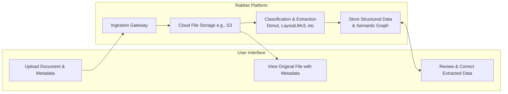
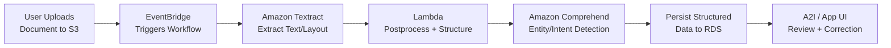
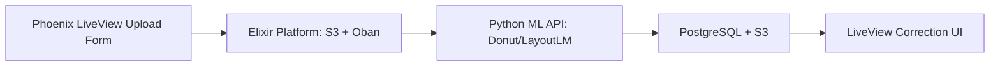

# Rabbet System Design Prompt

> System design (90 minutes): You'll walk through this prompt and discuss how you would design this system, important tradeoffs, any risks or unknowns, and so on. While there's no need to write code, you should come prepared to do some documentation. If you’d like a starting point, you can use our Tech Plan Template. Please come prepared to screen share on google meet or send us a link to a collaborative doc (e.g., google docs).

## Background  

Speeding up and improving the accuracy of construction loan document processing by extracting and classifying structured data from uploaded files.

Construction lenders must review and relate hundreds of pages of documentation to budgets and checklists every month. This is a manual, error-prone process. Rabbet aims to automate this by ingesting documents (PDFs, Excel) and extracting structured domain-specific information (e.g., budgets, invoices, pay applications), with human correction where automation falls short.

## Design



A document ingestion pipeline with automatic classification, structured data extraction, and a correction UI, implemented as a platform with one or more user applications.

**High-Level Flow: User App**

1. **Ingestion** - Document ingestion can occur via uploading to the service, adding to cloud storage, via email, etc. For a proof of concept, we will create a simple upload form with metadata.
2. **Retrieval** - Original documents can be retrieved and reviewed with metadata through the app.
3. **Processed Data** - After classification and extraction, documents can be reviewed and updated in table form through the app.

**High-Level Flow: Platform**

1. **Ingestion** – Documents are added to the system via endpoint, message bus, AWS event, etc.
2. **Storage** – Files are persisted in original form to cloud storage.
3. **Classification and Extraction** – Structured information is inferred using text recognition plus semantic graph-based entity linking  using LayoutMLv3 (FOSS) or NAVER Donut.
4. **Persist Structured Data** – Final structured data is stored in the system’s datastore

**Sample JSON** (from [NAVER CLOVA Donut](https://arxiv.org/abs/2111.15664))

```
{
  "completed_at": "2025-03-30T20:05:04.179364Z",
  "created_at": "2025-03-30T20:02:05.168000Z",
  "data_removed": false,
  "error": null,
  "id": "q895c1d6y1rga0cnx2jryp36a8",
  "input": {
    "image": "https://replicate.delivery/pbxt/MkdrQVHgtZXyVPOvZ29dtp0ORtxEAjWirT5VFT7F3JKfboQj/Pasted%20image.png"
  },
  "logs": null,
  "metrics": {
    "predict_time": 0.921335811,
    "total_time": 179.011364
  },
  "document_type": "invoice",
  "output": "{'menu': [{'nm': 'Average Architects', 'price': 'DATE: 3/24/2023'}, {'nm': \"We're just okay INVOICE #: 109\", 'num': 'CUSTOMER ID: A-3800', 'unitprice': '12203', 'cnt': '201', 'price': {'num': '555-795-3800'}}], 'sub_total': {'subtotal_price': 'Due on receipt', 'discount_price': '3800'}, 'total': {'total_price': '$400,700.00'}}",
  "started_at": "2025-03-30T20:05:03.258028Z",
  "status": "succeeded",
  "urls": {
    "get": "https://api.replicate.com/v1/predictions/q895c1d6y1rga0cnx2jryp36a8",
    "cancel": "https://api.replicate.com/v1/predictions/q895c1d6y1rga0cnx2jryp36a8/cancel"
  },
  "version": "6bdf3a5790f9cdf491e995a659563c3dcbe94d929e89216486e8fe3f909f4716"
}

Generated in 0.9 seconds
```

## Controversial Decisions

### 1. Follow the design principles of the [Reactive Manifesto](https://reactivemanifesto.org/)

>...
> We believe that a coherent approach to systems architecture is needed, and we believe that all necessary aspects are already recognised individually: we want systems that are Responsive, Resilient, Elastic and Message Driven. We call these Reactive Systems.
>
> Systems built as Reactive Systems are more flexible, loosely-coupled and scalable. This makes them easier to develop and amenable to change. They are significantly more tolerant of failure and when failure does occur they meet it with elegance rather than disaster. Reactive Systems are highly responsive, giving users effective interactive feedback.
> ...

#### Why a Reactive design?

We're building a system that must handle high volumes of unstructured documents with varying upload patterns, asynchronous processing needs (classification, extraction), and user corrections — all without blocking the user experience or sacrificing responsiveness.

The Reactive Manifesto offers a foundation for designing systems that are:

- Responsive (users can view progress or partial results),
- Resilient (parts can fail without bringing the whole system down),
- Elastic (scales up/down with workload), and
- Message-Driven (ideal for decoupled, async operations).

#### Trade-offs: Reactive design

| Trade-off                        | Pros                                                                 | Cons                                                                 |
|----------------------------------|----------------------------------------------------------------------|----------------------------------------------------------------------|
| **Complexity of Asynchronous Design** | Enables non-blocking operations, parallel workflows, and better resource utilization | Harder to debug, reason about, and test compared to synchronous flows |
| **Loose Coupling via Messaging** | Improves resilience and flexibility; components can evolve independently | Introduces operational overhead: message queues, retries, dead letter handling |
| **Elasticity / Backpressure**    | Handles bursty workloads without crashes or bottlenecks              | Requires careful observability, tuning, and sometimes over-provisioning |
| **Latency in Some Tasks**        | Background processing allows scaling and responsiveness              | Users may need to wait (e.g., classification/extraction is async) or view "pending" states |


#### Justification for a Reactive design

- **Asynchronous processing is core to the product experience**: Document ingestion, ML-driven classification, and extraction all occur after upload — making blocking the user flow unacceptable. Asynchronous queues and background workers keep the UI responsive while ensuring work is handled reliably.
- **Message-passing creates a clear boundary between concerns**: Ingestion, ML, storage, and review can be modular, isolated, and replaced/upgraded independently. Failures in extraction won’t affect document uploads or metadata storage.
- **Elasticity enables cost-effective scaling**: Since workloads may spike (e.g., monthly draws or batch uploads), we can scale extractors, queue consumers, and storage pipelines independently — leveraging auto-scaling groups or serverless functions.
- **Resilience is critical for long-running processes and external dependencies**: ML extraction might call out to models or services with variable latency. If we build synchronously, we risk timeouts or cascading failures. With reactive design, we can contain these failures and retry without user-visible impact.
- **User confidence depends on responsiveness, even if partial**: Users should be able to see a document was uploaded, is "Processing", or even partially extracted, rather than waiting on a blocking request. This is directly enabled by reactive principles.

### 2. Build our own classification / extraction pipeline

#### Why build our own pipeline?

In short, off-the-shelf solutions are either too generic, too expensive, or not adaptable to our domain-specific formats and semantic structures. We want fine-grained control over how construction loan documents (budgets, invoices, pay applications, etc.) are classified and parsed. Furthermore, AWS (as an example) does not have a service designed to do this work. Instead, using AWS dictates a need to increase complexity by assembling an AWS pipeline from smaller components.



By building our own pipeline, we can:

- Tune models to **our document types and layouts**
- Control **extraction schemas and graph outputs**
- Support evolving use cases (e.g. multi-page linking, layout heuristics, reprocessing)
- Optimize for **developer workflows and auditability**

Performance and cost should not be an issue. In the Donut example above, the model was launched on AWS' lowest-performing GPU compute unit, the G4. It has a Turing-class T4 data center GPU. With this configuration, the example invoice took less than 1 second to classify and extract data. It is trivial to exceed this performance at a reasonable cost using either cloud or dedicated hardware.

#### Trade-offs: pipeline

| Trade-off                         | Pros                                                                 | Cons                                                                 |
|-----------------------------------|----------------------------------------------------------------------|----------------------------------------------------------------------|
| **Control and Customization**     | Tailor models to our domain, layouts, and semantics                  | Requires more upfront design, experimentation, and maintenance*      |
| **Cost Efficiency Over Time**     | Avoid ongoing API fees from 3rd-party document services              | Initial investment is higher in time and expertise*                   |
| **ML Model Ownership**            | Enables transparency, auditability, and version control              | Responsibility for training, monitoring, and retraining falls on us* |
| **Extensibility**                 | Easy to adapt to new document types or integrate feedback loops      | Must design APIs and architecture for modular, pluggable components |
| **Latency Control**               | Can optimize runtime and performance for batch or real-time flows    | Need to manage compute infrastructure (GPU/CPU, scaling, timeouts)*  |

*Note that most cons associated with this approach are pushed back until after PoC and MVP.

#### Justification for building our own pipeline

- **3rd-party tools (e.g., Textract, Vision API, Azure Form Recognizer)** are tuned for generic forms and receipts, but lack the **layout-awareness and semantic linking** needed for our documents (e.g., linking budget line items to pay app sections).
- We already plan to use **layout-aware models (e.g., Donut, LayoutLMv3)** that can benefit from custom training and schema definition — meaning we’ll want a pipeline either way.
- Building our own pipeline now allows us to **embed domain knowledge**, **incorporate user corrections as training data**, and **support more intelligent downstream validation (e.g., budget consistency checks)** in future phases.
- This also aligns with our reactive, message-driven system — we can plug classification and extraction into a queue-based architecture, enabling retries, observability, and independent scaling.
- Finally, classifying and extracting this data is a core competency for the business, and creating our own pipeline, as modest as it may be, will increase the value of company IP.

## Rollout

### Staffing

This plan assumes a small, focused engineering team (~3 engineers, 1 product owner part time) and a short runway (4 - 6 weeks) to build a working proof-of-concept.

### Team Roles

| Role | Responsibilities |
|------|------------------|
| Backend Engineer | Ingestion, queue/event setup, model integration |
| ML Engineer | Model selection, fine-tuning, evaluation metrics |
| Frontend Engineer | Upload + review UI, field correction UX |
| PM / UX | Sample docs, correction experience feedback |

### Stack

- **Elixir / Phoenix LiveView** for the user-facing application
- **Elixir, Broadway** for the reactive platform backend
- **Python ML services, FastAPI or Flask** for classification & extraction
- **AWS S3** for file storage
- **PostgreSQL / RDS** for structured metadata
- **AWS SNS message-passing & async processing** for all platform operations

### Monorepo directory structure

```plaintext
rabbet/
├── apps/
│   ├── ui/                         # Phoenix LiveView UI (user app)
│   │   ├── lib/
│   │   │   ├── RabbetWeb/          # Controllers, Views, LiveViews
│   │   │   └── Components/         # Table, uploader, corrections, etc.
│   │   ├── assets/                 # Typescript, Tailwind
│   │   ├── templates/              # HTML templates for server-rendered UI
│   │   └── test/                   # Elixir LiveView + UI logic tests
│   │
│   └── platform/                   # Elixir app for backend services
│       ├── lib/
│       │   ├── Rabbet.Ingestion/   # File ingest handlers, S3 uploads, metadata
│       │   ├── Rabbet.Processor/   # Messaging, job queuing, extract pipeline
│       │   ├── Rabbet.Storage/     # Data model, PostgreSQL schema, versioning
│       │   └── Rabbet.Notifier/    # Pubsub or message bus hooks
│       ├── queues/                 # Broadway pipelines or GenStage flows
│       └── test/                   # Elixir backend service tests (Oban, storage, queues)
│
├── ml/                             # Python ML classification + extraction
│   ├── api/                        # FastAPI service for Donut or LayoutML, etc.
│   │   ├── inference.py            # Inference handler: file → structured JSON
│   │   └── test/                   # Python FastAPI API tests (e.g., pytest)
│   ├── preprocess/                 # PDF → image conversion, doc utils
│   │   └── test/                   # Unit tests for PDF parsing utils, etc.
│   ├── models/                     # Fine-tuned model weights, tokenizer
│   └── testdata/                   # PDFs + expected outputs
│
├── config/
│   ├── dev.exs                     # Elixir config for dev
│   ├── test.exs                    # Elixir config for test
│   └── prod.exs                    # Elixir config for prod
│
├── priv/
│   └── repo/                       # DB migrations
│
├── test/                           # Root-level integration tests
│   ├── integration/
│   └── fixtures/
│
├── mix.exs                         # Elixir app config
├── pyproject.toml                  # Primary config file (project metadata, dependencies)
└── README.md
```

### How the components interact



## Roadmap After Proof-of-Concept

Following successful delivery of the POC, we focus on extending the platform across five dimensions - all informed by face-to-face user feedback and observation.

| Area                        | Focus                                                   |
|-----------------------------|----------------------------------------------------------|
| **Security & access control** | Authentication, authorization, audit logging           |
| **Productization**         | CI/CD pipelines, versioning, uptime observability        |
| **Scalability**            | Distributed processing, job queue refinement, GPU autoscaling |
| **User feedback loops**    | Correction capture, confidence scoring, retraining hooks |
| **Data & insights**        | Usage analytics, structured data reporting, model metrics |

### Phase 1: authentication, authorization & audit

| Task                          | Description |
|-------------------------------|-------------|
| **User authentication**     | Integrate identity provider (e.g., Auth0, Cognito, or a LiveView-native auth system like `phx_gen_auth`) |
| **Role-Based Access Control (RBAC)** | Define admin, reviewer, and read-only roles with permission-scoped access to documents and corrections |
| **Audit logging**          | Log user actions like uploads, corrections, type overrides, review completions, etc., to a write-optimized audit table or stream |
| **Document-level access policies** | Ensure users only access documents they’re authorized to (e.g., by project, region, or client) |

### Phase 2: CI/CD, testing, and observability

| Task                          | Description |
|-------------------------------|-------------|
| **Automated testing pipelines** | Add CI pipeline (e.g., GitHub Actions) to run Elixir and Python tests on push/PR |
| **Containerization**       | Dockerize all components (Elixir UI/API, Python ML service) with multi-stage builds and GPU compatibility |
| **End-to-end tests** | Simulate document → storage → extraction → review → save workflows |
| **Observability**          | Integrate with services like Honeycomb, Grafana, or New Relic for tracking latency, errors, queue depth, etc. |
| **Logging & tracing**     | Ensure all services emit structured logs and support request-level tracing (OpenTelemetry, Logfmt/JSON logs) |

### Phase 3: Data quality, analytics & feedback

| Task                          | Description |
|-------------------------------|-------------|
| **Analytics dashboard**     | Track metrics like documents processed, extraction accuracy, time to review, correction rates |
| **Confidence thresholds**   | Surface low-confidence extractions for prioritized review |
| **Correction feedback loop**| Store user corrections in a training dataset for future finetuning |
| **Data export / reporting** | Enable exports of structured data by project, vendor, time window for reconciliation/reporting |

### Phase 4: Scalability & performance enhancements

| Task                          | Description |
|-------------------------------|-------------|
| **Queue prioritization & partitioning** | Separate priority queues (e.g., "fast track", "bulk") using Oban or Broadway tags |
| **Distributed processing** | Horizontally scale extraction workers (e.g., extractors running on GPU nodes via autoscaling groups or Fargate) |
| **Batching & streaming**    | Add support for batch uploads and streaming extraction pipelines |
| **GPU-aware job scheduling**| Route model jobs to available GPU nodes based on load, runtime estimate, or model type |

### Phase 5: Compliance, privacy & production hardening

| Task                          | Description |
|-------------------------------|-------------|
| **Rate limiting & abuse prevention** | Protect ingestion and correction endpoints from abuse or overload |
| **Data retention policies** | Implement configurable data expiration / archiving logic (especially for raw uploads) |
| **PII redaction**           | Add preprocessing layer to detect and optionally redact sensitive information in documents |
| **Compliance readiness**   | Lay groundwork for SOC2 / HIPAA-style control domains (access control, auditing, incident tracking) |

